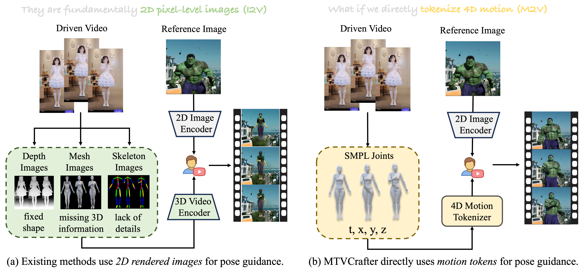
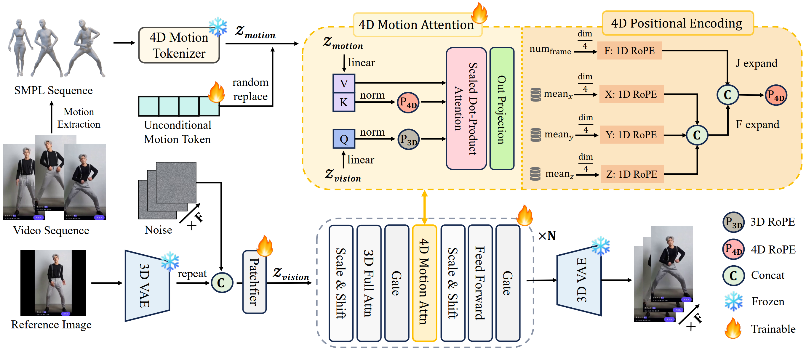

# MTVCrafter: 4D Motion Tokenization for Open-World Human Image Animation

> Official project page of **MTVCrafter**, a novel framework for general and high-quality human image animation using raw 3D motion sequences.

## 🔍 Abstract

Human image animation has attracted increasing attention and developed rapidly due to its broad applications in digital humans. However, existing methods rely on 2D-rendered pose images for motion guidance, which limits generalization and discards essential 3D information.  
To tackle these problems, we propose **MTVCrafter (Motion Tokenization Video Crafter)**, the first framework that directly models raw 3D motion sequences for human image animation beyond intermediate 2D representations.

- We introduce **4DMoT (4D motion tokenizer)** to encode raw motion data into discrete motion tokens, preserving compact but expressive spatio-temporal information.
- Then, we propose **MV-DiT (Motion-aware Video DiT)**, which integrates a motion attention module and 4D positional encodings to effectively modulate vision tokens with motion tokens.
- The overall pipeline facilitates high-quality human video generation guided by 4D motion tokens.

MTVCrafter achieves **state-of-the-art results with an FID-VID of 6.98**, outperforming the second-best by approximately **65%**. It generalizes well to diverse characters (single/multiple, full/half-body) across various styles.

## 🎯 Motivation

Our motivation is that directly tokenizing 4D motion captures richer and more expressive information than traditional pose-rendered images derived from the driven video.

## 💡 Method

*(1) 4DMoT*:
Our 4D motion tokenizer consists of an encoder-decoder framework to learn spatio-temporal latent representations of SMPL motion sequences,
and a vector quantizer to learn discrete tokens in a unified space.
All operations are performed in 2D space along frame and joint axes.

*(2) MV-DiT*:
Based on video DiT architecture,
we design a 4D motion attention module to combine motion tokens with vision tokens.
Since the tokenization and flattening disrupted positional information,
we introduce 4D RoPE to recover the spatio-temporal relationships.
To further improve the quality of generation and generalization,
we use learnable unconditional tokens for motion classifier-free guidance.

## 🎞️ Animation

---

## 📄 Citation

Coming soon.

## 📬 Contact

For questions or collaboration, feel free to reach out via GitHub Issues.
